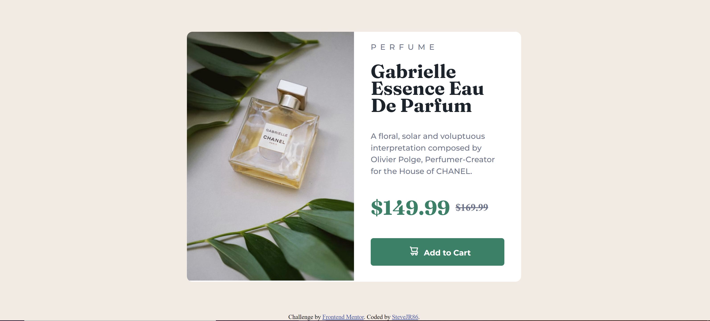

# Frontend Mentor - Product preview card component solution

This is a solution to the [Product preview card component challenge on Frontend Mentor](https://www.frontendmentor.io/challenges/product-preview-card-component-GO7UmttRfa). Frontend Mentor challenges help you improve your coding skills by building realistic projects. 

## Table of contents

- [Overview](#overview)
  - [The challenge](#the-challenge)
  - [Screenshot](#screenshot)
  - [Links](#links)
- [My process](#my-process)
  - [Built with](#built-with)
  - [What I learned](#what-i-learned)
  - [Continued development](#continued-development)
- [Author](#author)

## Overview

### The challenge

Users should be able to:

- View the optimal layout depending on their device's screen size
- See hover and focus states for interactive elements

### Screenshot

### Links

- Solution URL: [https://github.com/SteveJR86/product-preview-card-component-main](https://github.com/SteveJR86/product-preview-card-component-main)
- Live Site URL: [https://stevejr86.github.io/product-preview-card-component-main/](https://stevejr86.github.io/product-preview-card-component-main/)

## My process

### Built with

- Semantic HTML5 markup
- CSS custom properties
- Flex

### What I learned

This was the first attempt using flex and trying responsive design. while my solution adjusts for smaller screens I think having read more I should be designing Mobile First and then scaling up rather than Desktop First and scaling down.

### Continued development

I need to read further about flex vs grid and also responsive design.

## Author

- GitHub - [SteveJR86](https://https://github.com/SteveJR86)
- Frontend Mentor - [@SteveJR86](https://www.frontendmentor.io/profile/SteveJR86)
